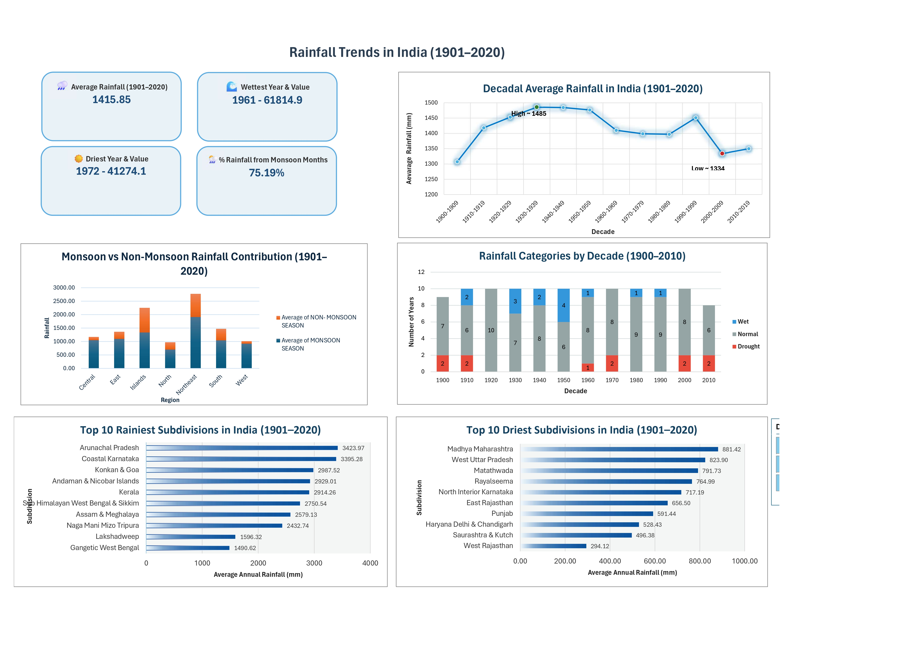

# 🌧️ Rainfall Trends in India (1901–2017)

 

---

## **📌 Project Overview**
This project explores **116 years of rainfall data in India (1901–2020)** sourced from the **Indian Meteorological Department (IMD)** via the **Open Government Data (OGD) Platform**.  

Through an **interactive Excel dashboard**, the analysis investigates:  

- 🌦️ **Seasonal patterns**  
- 📈 **Long-term trends**  
- 🗺️ **Regional differences in rainfall**  

**Skills showcased:** Data cleaning, pivot table analysis, interactive slicers, KPI design, and dashboard storytelling.

---

## **📊 Dataset Details**

- **Source:** IMD via [OGD Platform India](https://data.gov.in/)  
- **Time Period:** 1901–2017 (116 years)  
- **Geography:** 36 meteorological subdivisions of India  
- **Columns:** Monthly rainfall, seasonal totals, annual totals, region information  

---

## **📈 Key Insights**

- **Decadal Trends:** Rainfall varies significantly across decades.  
- **Seasonality:** Monsoon months (Jun–Sep) contribute ~75–80% of annual rainfall.  
- **Regional Variation:** Northeast India receives the highest rainfall; Northwest India is the driest.  
- **Top 10 vs Bottom 10 Regions:** Stark contrast between wettest (Meghalaya, Arunachal Pradesh) and driest (Rajasthan, Gujarat) regions.  
- **Monsoon Dependence:** India’s rainfall is largely driven by the monsoon season.  

---

## **📊 Dashboard Preview**

  

The Excel dashboard includes:  
- 🎛️ Interactive slicers by decade  
- 📊 KPI cards for key metrics  
- 📉 Charts: Line, Column, Bar, Pie  

---

## **🛠️ Tools Used**

- Microsoft Excel  
- Pivot Tables  
- Data Cleaning & Transformation  
- Slicers (Interactive filtering)  
- KPI Cards & Dashboard Layout Design  
- Charts: Line, Column, Bar, Pie  

---

## **🚀 Skills Demonstrated**

- **Data Cleaning:** Handling missing values, formatting, and standardization  
- **Exploratory Data Analysis (EDA):** Detecting trends and regional patterns  
- **Time-Series Analysis:** Visualizing decadal rainfall trends  
- **Dashboard Storytelling:** KPI cards, slicers, and interactive layout  
- **Data Visualization Best Practices:** Clear, informative charts  

---

## **📂 Repository Contents**

| File | Description |
|------|-------------|
| `Rainfall_Dashboard.xlsx` | Main Excel file with dashboard, data, and seasonal analysis |
| `Dashboard_preview.jpg` | Screenshot of the final dashboard |
| `README.md` | Project documentation |

---

## **👤 Author**

**Atul Singh Gusain**  
📧 gatul1312@gmail.com  
🔗 [LinkedIn](https://www.linkedin.com/in/atul-gusain-756160215/)
